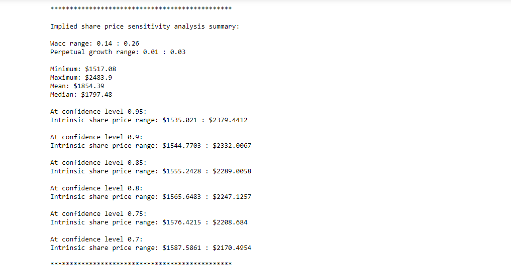
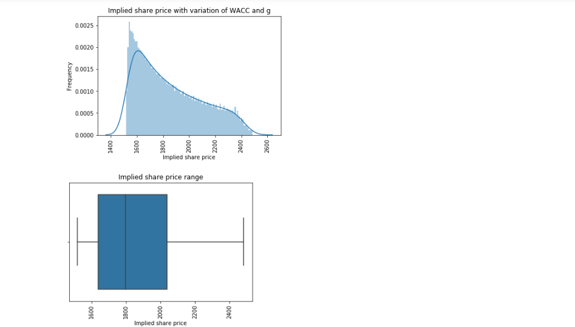
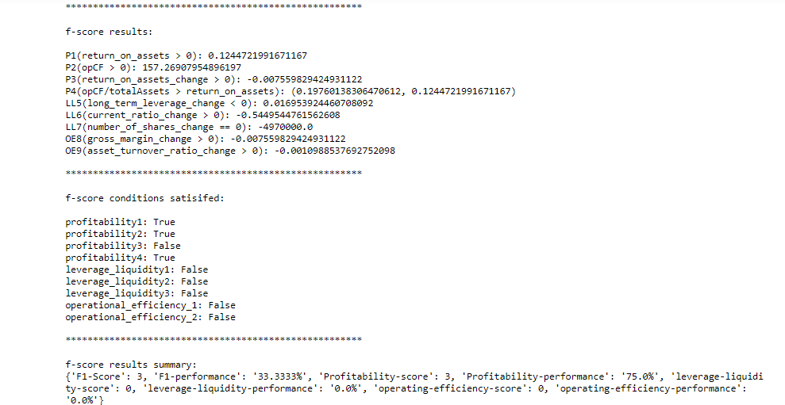

# AutomaticFundamentalsAnalysis

#### This project is for educational purposes and should not be used to guide any financial decisions.

## Project summary:

A DCF tool that automatically performs the DCF calculation and sensitivity analysis for a company. A Piotroski tool that automatically assigns an F1-Score to a company. All financial data collected via the financialmodelingprep API.

## Test example:

If we want to conduct a **DCF analysis** of Google (GOOG) using this project, we would perform the following steps (see Fundamentals_test_goog.py for more information):

# 

 - Use the get_statements() function to access the fundamental financial data in JSON format, using the financialmodelingprep API.
 
    - company_name: (str) ticker of the company of which we wish to perform the financial analysis.
    
    - statement_name: (str) One of the following: 'income-statement', 'balance-sheet-statement', 'cash-flow-statement', 'enterprise-value', 'financial-ratios'
    
    - api_key: (str) api_key provided by financialmodelingprep to access your account.
    
    - frequency: (str) 'quarterly', 'annual'
    
 - Instantiate the DCF object by using these statements as arguments:
 
    - income_statement: (json)
    
    - balance_sheet_statement: (json)
    
    - balance_sheet_statement_quarterly: (json)
    
    - cash_flow_statement: (json)
    
    - enterprise_value: (json)
    
    - financial_ratios: (json)
    
    - company_ticker: (str)
    
    - forecasting_period: (int)
    
    - api_key: (str)
    
 - Run the .dcf() method:
 
    - earnings_growth_rate: (float) expected growth rate of earnings throughout forecast-period.
    
    - cap_ex_growth_rate: (float) expected growth rate of earnings throughout forecast-period.
    
    - perpetual_growth_rate: (float) expected long-term growth rate of free-cash-flow.
    
    - confidence_intervals: (list/float) A list of all of the confidence intervals at which to perform the sensitivity analysis.
    
    - bound: (float) Determines the range of WACC and g values. (0 < bound < 1)
    
    - This will return a summary of the DCF calculation as well as the results.
    
    # 
    
 - Run the .sensitivity() method:
    
    - plot: (str) 'dist' returns a distplot, 'heat' returns a heatmap.
    
    - This will return a sensitivity analyis summary: results and plots showing the distribution of implied share price for variation in WACC and g.
    
    # 
    
    # 
    
 - Run the .f_score() method:
 
    - This will return the results and a summary of Piotroski f_score analysis.
    
    # 

## Motivations/Intentions:

I have two main motivations behind this project:

1)	Learn more about the fundamental valuation process for a potential investment.

2)	Learn about the challenges faced when applying financial practises in a technological context.

I decided to implement the tools in class format for the following reasons:

-	Easily integrate these tools with other projects, such as the portfolio optimisation bot.

-	Represent companies as instances of these classes and then use these instances to compare companies when analysing a wide range of investments.

-	Easily add/alter functionality of each object.

## Description:

To use this project you will need to make a financialmodelingprep account in order to access their financial data stores. Documentation can be found here: https://financialmodelingprep.com/developer/docs/ 

**A DCF (Discounted-Cash-Flow)** calculates the intrinsic value of a company. It sums the present values of the FCF (Free-Cash-Flow) and the TV (Terminal-Value) to calculate the EV (Enterprise-Value), before making necessary adjustments to reach the implied equity value. Below are the steps based on the research that I have conducted:

-	Define the driving factors and estimate their growth throughout a forecasting period.

-	Calculate the WACC (Weighted-Average-Cost-of-Capital):

    o	Use the interest-coverage ratio method to calculate the cost-of-debt.
    
    o	Use the CAPM model to calculate the cost of equity.
    
    o	Use US-treasury bonds to calculate the risk-free-rate (if company in the US).
   
    o	Use the index of the company to calculate the expected market return.
    
-	Calculate the FCF for each year and discount back to the present value, using the WACC (Weighted-Average-Cost-of-Capital).

-	Sum each of the present values for the FCF during the forecast period.

-	Calculate the TV (Terminal-Value) of the company using the perpetual-growth-method and then convert to present value by discounting it by WACC for the forecast period.

    o	Use the ____ to calculate g (Perpetual-Growth-Rate).
    
-	Calculate the EV (Enterprise-Value) of the company by summing the net present values of the FCF and TV.

-	To calculate the implied equity value from the Enterprise-Value:

    o	Add cash or cash-equivalents
    
    o	Subtract debt
    
-	To calculate the implied price-per-share, divide the equity value by the number of outstanding shares.

-	To make our analysis more useful, we then conduct sensitivity analysis on the arguments WACC, g. This then produces a range for the intrinsic value per share of the company.

**Piotroski’s F-Score** is a number between 0 and 9 which is used to asses the strength of a company’s financial position. It analyses different aspects such as the profitability, liquidity, leverage and operational efficiency of the company. The specific conditions of Piotroski’s F-Score are as follows:

#### Profitability 

    1.	Return on Assets (1 point if it is positive in the current year, 0 otherwise);
    
    2.	Operating Cash Flow (1 point if it is positive in the current year, 0 otherwise);
    
    3.	Change in Return of Assets (ROA) (1 point if ROA is higher in the current year compared to the previous one, 0 otherwise);
    
    4.	Accruals (1 point if Operating Cash Flow/Total Assets is higher than ROA in the current year, 0 otherwise);
    
#### Leverage, Liquidity and Source of Funds

    5.	Change in Leverage (long-term) ratio (1 point if the ratio is lower this year compared to the previous one, 0 otherwise);
    
    6.	Change in Current ratio (1 point if it is higher in the current year compared to the previous one, 0 otherwise);
    
    7.	Change in the number of shares (1 point if no new shares were issued during the last year);
    
#### Operating Efficiency

    8.	Change in Gross Margin (1 point if it is higher in the current year compared to the previous one, 0 otherwise);

    9.	Change in Asset Turnover ratio (1 point if it is higher in the current year compared to the previous one, 0 otherwise);
    
## Dependencies

- requests

- pandas

- pandas_datareader

- numpy

- seaborn

- matplotlib

- financialmodelingprep

## Challenges:

-	Dealing with the pricing aspects of the DCF calculation, such as the growth of the driving factors or the assumptions that are involved with the calculation of WACC. I will research some ways to tackle this and try to implement them in the future. Any suggestions are welcome.

-	Dealing with missing company fundamental data. This can have a huge effect on the outcome of the calculation. It is imperative to check the input data for any anomalies before use.

-	I found that the Piotroski F-Score will naturally vary between industries so it should only be used to compare companies within the same industry. Additionally, multiple scores should be measured over time as to account for changes in the market environment/company strategy etc.

## Conclusion:

Having learned more about the fundamental analysis process and its technological implementations, I realise that although there are a lot of calculations that can be automated, saving time. Nevertheless, there are significant challenges presented when trying to automate the human aspect of company valuation (pricing/assumptions).

## Sources:

  https://corporatefinanceinstitute.com/resources/templates/excel-modeling/stable-growth-vs-2-stage-valuation-model/
  
  https://en.wikipedia.org/wiki/Piotroski_F-score#:~:text=Piotroski%20F%2Dscore%20is%20a,Stanford%20accounting%20professor%20Joseph%20Piotroski.
  
  

